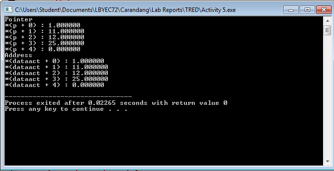

# lbyec72-ej1-p4-pointers-mathewgabsam
lbyec72-ej1-p4-pointers-mathewgabsam created by GitHub Classroom

I tried at first. I failed. 
 

 
I was kind of getting it. 
 

 
I am trying my best to get it. Sorry i'll study about pointers
 

